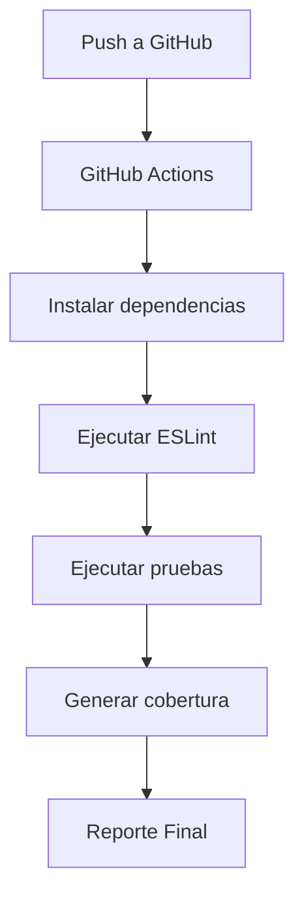

# CI REPORT - Mini Proyecto de Integración Continua

## Descripción

Se desarrolló un servicio web REST utilizando Node.js y Express aplicando principios de Integración Continua.

---

## Pipeline CI

---

## Métricas de Calidad

| Métrica | Resultado |
|----------|------------|
| Cobertura Statements | 97.95% |
| Cobertura Branches | 100% |
| Cobertura Functions | 87.5% |
| Cobertura Lines | 97.91% |

---

## Herramientas utilizadas

- Node.js
- Express
- Jest
- Supertest
- GitHub Actions
- ESLint
- SonarCloud

---

## Justificación

Se estableció una cobertura superior al 80% para garantizar la calidad del código y detectar errores de manera temprana durante el proceso de Integración Continua.

Las pruebas unitarias y de integración permiten validar el correcto funcionamiento de la API antes de cada integración en GitHub.