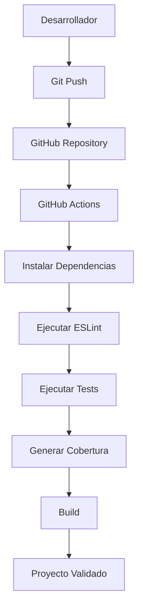

# Mini-proyecto de Integración Continua para Servicios Web

## Autor

Jhonnatan Duarte

## Descripción

Este proyecto consiste en el desarrollo de un servicio web REST utilizando Node.js y Express.js, aplicando principios de Integración Continua (CI), pruebas automatizadas, control de versiones y aseguramiento de la calidad del software.

El proyecto implementa un CRUD básico para la gestión de productos y automatiza la validación del código mediante GitHub Actions.

---

# Arquitectura del Proyecto

```
mini-proyecto-ci
│
├── .github/
│   └── workflows/
│       └── ci.yml
│
├── src/
│   ├── controllers/
│   ├── data/
│   ├── routes/
│   ├── services/
│   ├── app.js
│   └── server.js
│
├── tests/
│   ├── productRoutes.test.js
│   └── productService.test.js
│
├── coverage/
├── package.json
├── eslint.config.js
├── sonar-project.properties
└── CI_REPORT.md
```

---

# Pipeline de Integración Continua



---

# Tecnologías Utilizadas

- Node.js
- Express.js
- Git
- GitHub
- GitHub Actions
- Jest
- Supertest
- ESLint
- SonarCloud (configuración preparada)

---

# Endpoints REST

## Obtener productos

Método:
GET

Ruta:
`/products`

Descripción:
Retorna la lista de productos registrados.

---

## Crear producto

Método:
POST

Ruta:
`/products`

Descripción:
Permite registrar un nuevo producto.

---

## Eliminar producto

Método:
DELETE

Ruta:
`/products/:id`

Descripción:
Elimina un producto mediante su identificador.

---

# Funcionalidades Implementadas

El servicio REST permite:

- Obtener todos los productos.
- Registrar nuevos productos.
- Eliminar productos existentes.

---

# Pruebas Implementadas

Se desarrollaron pruebas unitarias para validar la lógica de negocio del servicio.

También se implementaron pruebas de integración utilizando Supertest para validar el comportamiento de los endpoints REST.

Resultados obtenidos:

- 11 pruebas ejecutadas.
- 11 pruebas exitosas.
- 0 pruebas fallidas.

---

# Cobertura del Código

Resultados obtenidos mediante Jest Coverage.

| Métrica | Resultado |
|----------|----------:|
| Statements | 97.95% |
| Branches | 100% |
| Functions | 87.50% |
| Lines | 97.91% |

El umbral mínimo solicitado era del 80%, por lo que el proyecto supera ampliamente el requisito establecido.

---

# Calidad del Código

Se configuró ESLint para realizar análisis estático del código fuente y verificar el cumplimiento de buenas prácticas de programación.

Además, el proyecto incluye la configuración necesaria para integrarse con SonarCloud.

---

# Automatización CI

El pipeline de GitHub Actions ejecuta automáticamente las siguientes tareas:

1. Instalación de dependencias.
2. Análisis estático (ESLint).
3. Ejecución de pruebas.
4. Generación del reporte de cobertura.
5. Validación del proceso de construcción.

Esto garantiza que cualquier cambio enviado al repositorio sea validado automáticamente antes de su integración.

---

# Justificación de los Umbrales

Se estableció un porcentaje mínimo de cobertura superior al 80% debido a que este valor permite detectar la mayoría de errores funcionales sin incrementar significativamente el costo de mantenimiento de las pruebas.

La automatización de pruebas reduce el riesgo de introducir errores durante futuras modificaciones del sistema y facilita la integración continua.

---

# Conclusiones

Durante el desarrollo del proyecto se aplicaron prácticas de Integración Continua utilizando herramientas modernas del ecosistema JavaScript.

La automatización de pruebas, la verificación mediante ESLint y la integración con GitHub Actions permiten mantener un proceso de desarrollo más confiable y con mayor calidad.

Los resultados obtenidos demuestran que el servicio REST cumple con los requisitos funcionales y de calidad establecidos para la actividad.